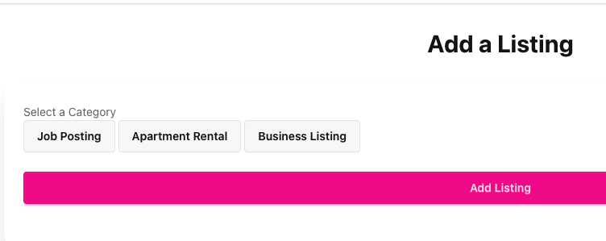

# astro.client.load.issue

# Expected Result

When a user selects a category (listingType) and clicks the "Add Listing" button, the button gets hidden and a dyanmic form is generated based on the listingType's attributes.

# Actual Result

In the browser's console log, receiving various errors depending on current changes. The current file and "npm run dev' is ran, receving `Failed to load module script: Expected a JavaScript module script but the server responded with a MIME type of "text/html". Strict MIME type checking is enforced for module scripts per HTML spec.
`

# Dilemma

The initial basic version of this requirement was working fine, as I made changes to improve the form, lost track of commit that broke the form.